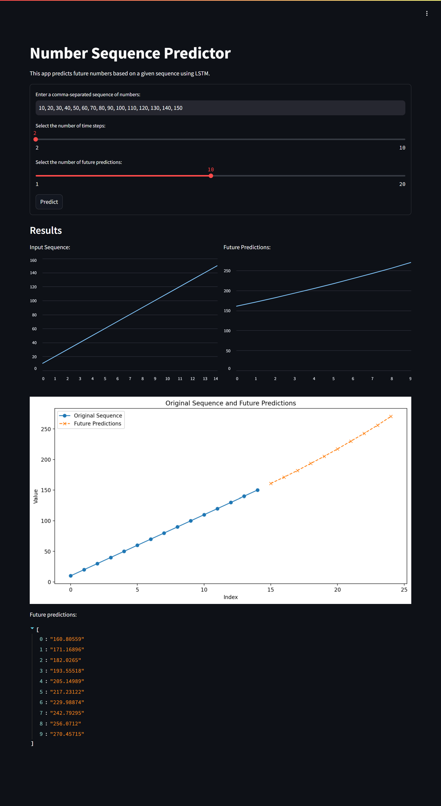

# Number Sequence Predictor



## Project Overview

The Number Sequence Predictor is a machine learning application that predicts future numbers in a sequence based on a given input. This project uses a Long Short-Term Memory (LSTM) neural network to generate predictions. It provides a user-friendly web interface built with Streamlit, allowing users to input a sequence of numbers and receive instant predictions for future values.

This project demonstrates the application of time series analysis and deep learning in creating a practical tool for data analysts, researchers, and anyone interested in sequence prediction. It serves as an excellent example of an end-to-end machine learning project, from data preprocessing and model training to deploying a web application with multiple hosting options.

## Table of Contents

1. [Dataset](#dataset)
2. [Model Training](#model-training)
3. [Streamlit Application](#streamlit-application)
4. [Deployment Options](#deployment-options)
5. [File Structure](#file-structure)
6. [Usage](#usage)

## Dataset

The dataset used for this project is a sequence of numbers provided by the user. The application is flexible and can work with various numeric sequences.

## Model Training

The model training process is detailed in the `Predicting_Sequence.ipynb` notebook. This notebook covers data preprocessing, model architecture, and the implementation of the LSTM model for sequence prediction.

You can train the model locally or use Google Colab for training. To use Google Colab:
1. Upload the `Predicting_Sequence.ipynb` notebook to Google Colab.
2. Run the notebook cells to train the model.
3. Download the trained model file.

## Streamlit Application

The Streamlit application is defined in `app/app.py`. It provides a user interface for inputting a number sequence and viewing the predicted future values.

## Deployment Options

There are several ways to deploy and use this application:

1. **Run Locally**:
   - Clone the repository:
     ```
     git clone https://github.com/pouryare/number-sequence-predictor.git
     cd number-sequence-predictor
     ```
   - Navigate to the `app` directory: `cd app`
   - Create a virtual environment: 
     ```
     python -m venv venv
     source venv/bin/activate  # On Windows use `venv\Scripts\activate`
     ```
   - Install requirements: `pip install -r requirements.txt`
   - Run the Streamlit app: `streamlit run app.py`
   - Open a web browser and go to `http://localhost:8501`

2. **Use Docker**:
   - Install [Docker](https://docs.docker.com/get-docker/) on your machine.
   - Pull the image from Docker Hub: 
     ```
     docker pull pouryare/number-sequence-predictor:latest
     ```
   - Run the container: 
     ```
     docker run -p 8501:8501 pouryare/number-sequence-predictor:latest
     ```

   Alternatively, you can build the image locally:
   - Navigate to the `app` directory
   - Build the Docker image: 
     ```
     docker build -t number-sequence-predictor:latest .
     ```
   - Run the container: 
     ```
     docker run -p 8501:8501 number-sequence-predictor:latest
     ```

3. **Deploy on Heroku**:
   - Create a Heroku account and install the [Heroku CLI](https://devcenter.heroku.com/articles/heroku-cli).
   - Login to Heroku: `heroku login`
   - Create a new Heroku app: `heroku create number-sequence-predictor`
   - Add the following buildpacks:
     ```
     heroku buildpacks:add --index 1 heroku/python
     heroku buildpacks:add --index 2 https://github.com/heroku/heroku-buildpack-apt
     ```
   - Ensure that `Procfile` and `setup.sh` are in the `app/` directory before deploying.
   - Deploy the app: `git push heroku main`
   - Open the app: `heroku open`

4. **Deploy on Google Cloud Platform**:
   - Set up a [Google Cloud account](https://cloud.google.com/) and create a new project.
   - Install the [Google Cloud SDK](https://cloud.google.com/sdk/docs/install).
   - Make sure `app.yaml` is in the `app/` directory before deploying.
   - Initialize your app: `gcloud app create`
   - Deploy the app: `gcloud app deploy`
   - Access your app: `gcloud app browse`

## File Structure
```
number-sequence-predictor/
├── app/
│   ├── app.py
│   ├── Dockerfile
│   ├── requirements.txt
│   ├── Procfile
│   ├── app.yaml
│   ├── setup.sh
│   └── setup.py
├── Predicting_Sequence.ipynb
├── number_sequence_model.keras
├── README.md
└── screenshot.png
```

## Usage

1. Open the application (either locally or on a deployed platform).
2. Enter a sequence of numbers in the input field provided.
3. Select the number of time steps and future predictions.
4. Click the "Predict" button to view the predicted future values.

---

This project demonstrates the application of deep learning in creating a number sequence prediction tool with a web application interface. It serves as an excellent example of an end-to-end machine learning project with practical applications in time series analysis and forecasting.

For any issues or suggestions, please open an issue on the [GitHub repository](https://github.com/pouryare/number-sequence-predictor).
